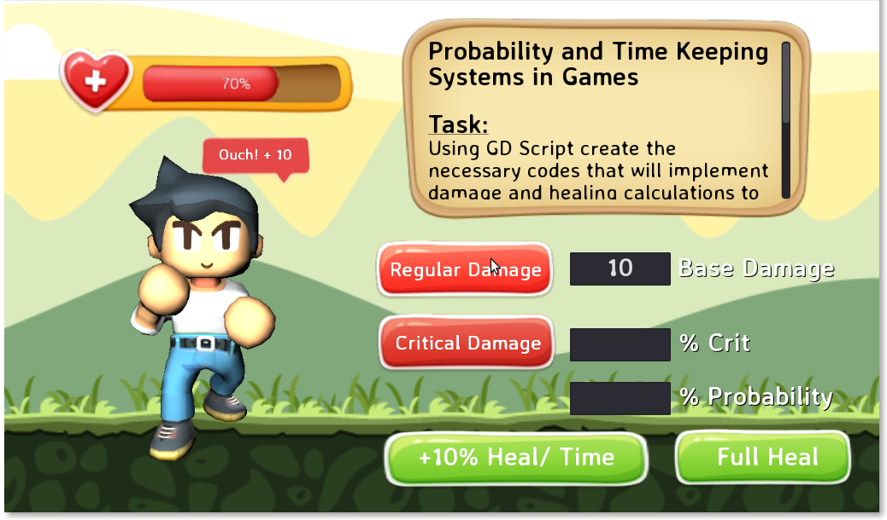

# Probability and Time Keeping System in Games
***

## The Challenge
Using GD Script create the necessary codes that will implement damage and healing calculations to the character's health bar. A critical damage calculation should be also implemented based on the value of the critical probability box. Damage/Heal calculations can also be modified using a time keeping system. The basic damage calculation and full heal implementation is already done for your team to serve as a guide. **Be creative**.

> This homework is worth **50 points**

# Screenshot

## Instructions
1. Invite team members to work for this homework  (maximum of three members per team).
1. Fork or download this repository.
1. Open the project in Godot.
1. Modify the project in compliance with the given instructions.
1. Submit your output personally next meeting.

## Engine
### Godot Game Engine
- is an advanced, feature packed, multi-platform 2D and 3D game engine. It provides a huge set of common tools, so you can just focus on making your game without reinventing the wheel. **Download the engine [here](http://www.godotengine.org/documents/188)**.

## Game Asset Credits
* Game Character / Agent - [Superpowers Game Engine Assets](http://superpowers-html5.com/)
* Background Art - [BuildBox Game Engine Assets](https://www.buildbox.com/)
* Game HUD - [GraphicBurger](http://graphicburger.com)

## Reminders
* Please respect the terms of use and/or license of any code you find, and if you reimplement or duplicate an algorithm or code from elsewhere, credit the original source with an inline comment.
* Don't forget to check what kind of open source license a source code have. You may want to visit [choosealicense.com](http://choosealicense.com) for more information.

***

Happy coding,

 
**mjsolidarios**
 part-time-faculty | cictwvsu | ph
